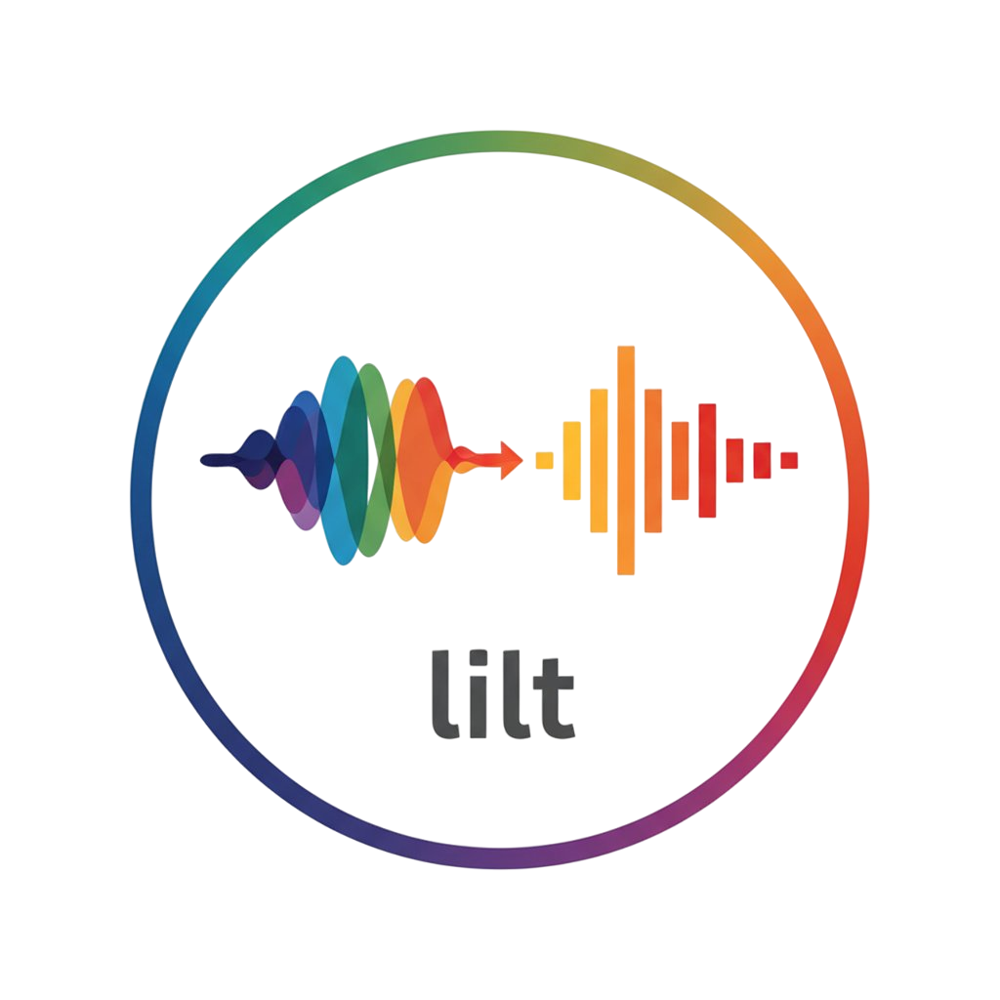

# Lilt GUI



A modern, cross-platform desktop GUI application for [Lilt](https://github.com/Ardakilic/lilt) - the lightweight intelligent lossless transcoder. Built with Tauri, React, and TypeScript.

[](https://github.com/Ardakilic/lilt-gui/actions/workflows/ci.yml)
[](https://opensource.org/licenses/MIT)
[](https://github.com/Ardakilic/lilt-gui/releases)

## About

Lilt GUI provides a user-friendly interface for the [Lilt command-line tool](https://github.com/Ardakilic/lilt), which converts Hi-Res FLAC and ALAC files to 16-bit formats with intelligent quality optimization. The GUI makes it easy to configure conversion options, monitor progress, and manage audio transcoding workflows without using the command line.

### Features

- 🎨 **Modern UI**: Clean, responsive interface built with React and Tailwind CSS
- 🌍 **Multi-language**: Support for English, Turkish, German, and Spanish
- 🔧 **Binary Detection**: Automatic detection of required tools (Lilt, SoX, FFmpeg) in system PATH
- 🐳 **Docker Support**: Run transcoding with Docker containers (no local tool installation required)
- 📂 **File Management**: Easy directory selection with file browser integration
- ⚙️ **Flexible Configuration**: Support for all Lilt options including output formats and metadata handling
- 📊 **Real-time Output**: Live process monitoring with terminal-style output display
- 💾 **Settings Persistence**: Automatic saving and restoration of user preferences
- 🛠️ **Tooltips & Help**: Comprehensive help system with detailed tooltips
- 🔄 **Process Control**: Start, stop, and monitor transcoding processes

### Supported Formats

- **Input**: FLAC (Hi-Res), ALAC (.m4a), MP3
- **Output**: FLAC (16-bit), MP3 (320kbps), ALAC (16-bit)
- **Smart Conversion**: Intelligent bit-depth and sample rate optimization
- **Metadata Preservation**: Copy ID3 tags and cover art using FFmpeg

## Installation

### Download Pre-built Binaries

Download the latest release for your platform from the [Releases](https://github.com/Ardakilic/lilt-gui/releases) page:

- **Windows**: `lilt-gui-windows-x86_64.msi` or `lilt-gui-windows-aarch64.msi`
- **macOS**: `lilt-gui-macos-x86_64.dmg` or `lilt-gui-macos-aarch64.dmg`
- **Linux**: `lilt-gui-linux-x86_64.AppImage` or `lilt-gui-linux-aarch64.AppImage`

### Build from Source

See the [Development](#development) section for build instructions.

## Usage

### Getting Started

1. **Install Lilt**: Download the [Lilt binary](https://github.com/Ardakilic/lilt/releases) or configure Docker mode
2. **Launch Lilt GUI**: Open the application
3. **Configure Paths**: Set binary paths or enable Docker mode
4. **Select Directories**: Choose source and target directories
5. **Configure Options**: Set output format and conversion preferences
6. **Start Transcoding**: Click "Start Transcoding" to begin processing

### Configuration Options

#### Binary Paths

- **Lilt Binary**: Path to the Lilt executable (required)
- **SoX/SoX-NG**: Audio processing tools (not needed with Docker)
- **FFmpeg/FFprobe**: For ALAC support and metadata (not needed with Docker)

#### Docker Mode

- **Use Docker**: Enable containerized processing (recommended)
- **Docker Image**: Default `ardakilic/sox_ng:latest` includes all tools

#### Conversion Settings

- **Output Format**: Default (smart), FLAC, MP3, or ALAC
- **Copy Images**: Include JPG/PNG files in output
- **Preserve Metadata**: Copy ID3 tags and cover art (enabled by default)

### Keyboard Shortcuts

- `Ctrl/Cmd + O`: Open source directory
- `Ctrl/Cmd + S`: Open target directory
- `Ctrl/Cmd + R`: Start transcoding
- `Ctrl/Cmd + .`: Stop transcoding
- `F1`: Open help dialog

## Development

### Prerequisites

- **Docker**: For containerized development environment
- **Make**: For running development commands

### Quick Start

```bash
# Clone the repository
git clone https://github.com/Ardakilic/lilt-gui.git
cd lilt-gui

# Initial setup
make setup

# Start development server
make dev
```

### Development Commands

All development is done through Docker to ensure consistency:

```bash
# Development
make dev              # Start development server
make build            # Build for production
make test             # Run tests
make test-coverage    # Run tests with coverage

# Code Quality
make lint             # Run linter
make lint-fix         # Fix linting issues
make format           # Format code
make format-check     # Check formatting

# Docker
make docker-dev       # Start Docker development
make docker-test      # Run tests in Docker
make docker-clean     # Clean Docker images

# Utilities
make clean            # Clean build artifacts
make icons            # Generate app icons
make logs             # View development logs
make shell            # Open development shell
```

### Project Structure

```
lilt-gui/
├── src/                    # Frontend source code
│   ├── components/         # React components
│   ├── i18n/              # Internationalization
│   ├── types/             # TypeScript type definitions
│   └── test/              # Test utilities
├── src-tauri/             # Tauri backend (Rust)
│   ├── src/               # Rust source code
│   └── icons/             # Application icons
├── lilt-assets/           # Project assets
├── .github/               # GitHub Actions workflows
├── docker-compose.yml     # Docker development setup
├── Dockerfile             # Development container
├── Makefile              # Development commands
└── package.json          # Frontend dependencies
```

### Technology Stack

- **Frontend**: React 18, TypeScript, Tailwind CSS
- **Backend**: Tauri (Rust), Tokio for async operations
- **Build**: Vite, ESBuild
- **Testing**: Vitest, Testing Library
- **Internationalization**: i18next, react-i18next
- **Icons**: Lucide React
- **Development**: Docker, Make

### Building for Production

```bash
# Build all platforms
make ci

# Build specific platform
make tauri-build

# Create release artifacts
make release-prod
```

### Testing

```bash
# Run all tests
make test

# Run with coverage (requires 80%+ coverage)
make test-coverage

# Run tests with UI
make test-ui

# Run specific test file
npm test -- src/components/Header.test.tsx
```

### Contributing

1. Fork the repository
2. Create a feature branch: `git checkout -b feature/amazing-feature`
3. Make your changes
4. Run tests: `make test`
5. Run linting: `make lint`
6. Commit changes: `git commit -m 'Add amazing feature'`
7. Push to branch: `git push origin feature/amazing-feature`
8. Open a Pull Request

### Code Style

- **TypeScript**: Strict mode enabled
- **React**: Functional components with hooks
- **Styling**: Tailwind CSS utility classes
- **Formatting**: Prettier with 2-space indentation
- **Linting**: ESLint with TypeScript rules

## Localization

Lilt GUI supports multiple languages. To add a new language:

1. Create a new translation file in `src/i18n/locales/`
2. Add the language to the `LANGUAGES` array in `src/components/Header.tsx`
3. Import the translation in `src/i18n/i18n.ts`

### Current Languages

- 🇺🇸 English (en)
- 🇹🇷 Turkish (tr)
- 🇩🇪 German (de)
- 🇪🇸 Spanish (es)

Translation contributions are welcome!

## Requirements

### System Requirements

- **Windows**: Windows 10 or later
- **macOS**: macOS 10.15 (Catalina) or later
- **Linux**: Ubuntu 18.04+ or equivalent

### Dependencies

#### Docker Mode (Recommended)

- Docker Desktop or Docker Engine

#### Local Mode

- [Lilt binary](https://github.com/Ardakilic/lilt/releases)
- [SoX](http://sox.sourceforge.net/) or [SoX-NG](https://codeberg.org/sox_ng/sox_ng)
- [FFmpeg](https://ffmpeg.org/) (for ALAC support and metadata)

## Troubleshooting

### Common Issues

**Binary not found errors**:

- Use the "Identify" button to auto-detect binaries
- Manually specify full paths to executables
- Enable Docker mode to avoid local installation

**Permission denied errors**:

- Ensure Lilt GUI has read/write access to source and target directories
- Run as administrator/root if necessary

**Docker errors**:

- Ensure Docker is running
- Check Docker image availability: `docker pull ardakilic/sox_ng:latest`

**Performance issues**:

- Enable Docker mode for better resource management
- Close other applications during large transcoding jobs
- Ensure sufficient disk space in target directory

### Getting Help

- 📖 Check the built-in help dialog (F1)
- 🐛 Report issues on [GitHub Issues](https://github.com/Ardakilic/lilt-gui/issues)
- 💬 Ask questions in [GitHub Discussions](https://github.com/Ardakilic/lilt-gui/discussions)
- 📧 Contact the author: [GitHub Profile](https://github.com/Ardakilic/)

## License

This project is licensed under the MIT License - see the [LICENSE](LICENSE) file for details.

## Acknowledgments

- [Lilt](https://github.com/Ardakilic/lilt) - The underlying audio transcoding tool
- [Tauri](https://tauri.app/) - Rust-based desktop app framework
- [SoX](http://sox.sourceforge.net/) / [SoX-NG](https://codeberg.org/sox_ng/sox_ng) - Audio processing
- [FFmpeg](https://ffmpeg.org/) - Multimedia framework
- [React](https://reactjs.org/) - UI framework
- [Tailwind CSS](https://tailwindcss.com/) - CSS framework

## Related Projects

- [Lilt](https://github.com/Ardakilic/lilt) - Command-line audio transcoder
- [SoX-NG Docker](https://github.com/Ardakilic/sox_ng_dockerized) - Containerized SoX-NG

---

**Author**: [Arda Kilicdagi](https://github.com/Ardakilic/)

**Repository**: [https://github.com/Ardakilic/lilt-gui](https://github.com/Ardakilic/lilt-gui)
